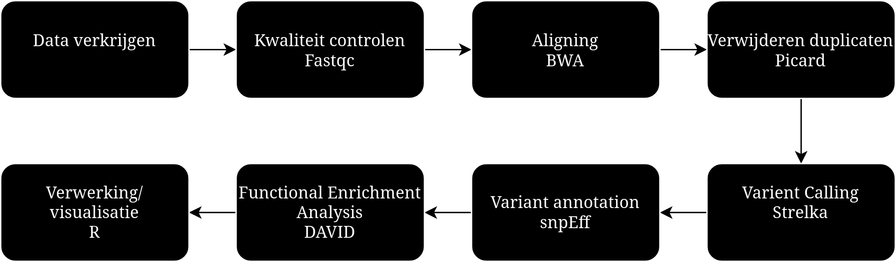
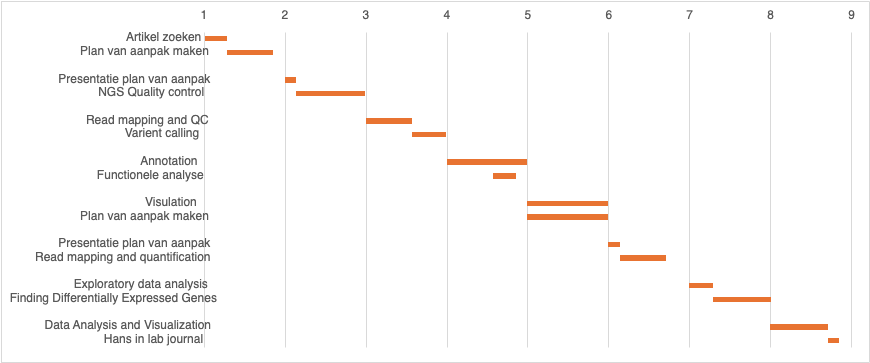

```{r setup, include=FALSE}
knitr::opts_chunk$set(echo = TRUE)
```


## Het onderzoek

Het onderzoek richt zich op de behandeling van blaaskanker met immuuncheckpointeiwitten (hierna genoemd als ICI's). ICI's zijn een goede stap in de richting van de behandeling tegen blaaskanker, echter reageert maar een klein deel van de patiënten goed op dit type behandeling. Daarom wordt er in deze studie gekeken hoe het gebruik van epigenetische middelen de werking van ICI's kunnen versterken, en dan specifiek naar entinostat. Entinostat is een selectieve remmer van HDAC1/3 en reageert als een krachtig middel in de muismodellen voor de typen blaaskanker BBN963 en BBN966. Er wordt aangetoond dat entinostat specifiek de immuunreactie op tumor-neoantigenen versterkt wat leidt tot een verandering in de samenstelling van de tumoromgeving. Ook geeft het een sterke antitumorreactie waarbij de tumor zelf wordt beïnvloed. Het proces is afhankelijk van antigeenpresentatie en gaat gepaard met een toename van het aantal T-cellen die gericht zijn op deze neoantigenen. De combinatietherapie van anti-PD-1 en entinostat heeft tot volledige tumorremissie geleidt en zorgde ook voor ene langdurig immuungeheugen. De bevindingen bieden een duidelijk mechanisme over hoe entinostat werkt en ondersteunen het gebruik van deze combinatie bij blaaskanker. [1, Abstract]


### Waarom en hoe is het onderzoek uitgevoerd?

Het onderzoek is gepubliceerd in augustus 2021.
In de Verenigde Staten worden jaarlijks rond de 83 duizend nieuwe gevallen van blaaskanker gediagnosticeerd waarvan ruim 17 duizend mensen naar schatting komen te overlijden. Voor patiënten met een vergevorderd of uitegezaaide blaaskanker is de overlevingskans, 5 jaar na de diagnose, slechts 15%. Na jarenlang geen nieuwe behandelingen voor gevorderde blaaskanker, zijn er de afgelopen jaren verschillende anitlichamen goedgekeurd die zich richten op de PD-1/PD-L1-route. Blaaskanker heeft een hoge mutatiefrequentie en een deel van deze mutaties kan worden gepresenteerd als neo-antigenen op het oppervlakte van tumorcellen. De neo-antigenen kunnen door T-cellen worden herkend waardoor het immuunsysteem de tumorcellen kan opruimen. De hoeveelheid gemuteerde tumor cellen (TMB) wordt gezien als één van de bepalende factoren die bepaalt of ICI's werken. [1]

PD-1 checkpointeiwitten zitten op tumorcellen, PD-L1 checkpointeiwitten zitten op T-cellen.De binding van PD-L1 met PD-1, weerhoudt T-cellen van het kapotmaken van tumorcellen in het lichaam. Wanneer de binding geblokkeerd wordt met een immuuncheckpointremmer, kunnen de T-cellen de tumorcellen dus wel kapotmaken. [2]

De ICI's zijn bedoeld voor patiënten die niet reageren, of niet in aanmerking komen voor cisplatinebehandelingen. Dit is een cytostaticum middel en wordt voorgeschreven als chemotherapie. [1, 3]


#### Entinostat en zijn werking

Entinostat is een zeer selectieve remmer van histondeacetylase (HDAC) 1 en 3. HDAC's verwijderen acetylgroepen van histonen, wat ervoor zorgt dat DNA strakker om de histonen wordt gewikkeld, waardoor genen minder toegankelijk worden voor transcriptieregelaars. Dit onderdrukt de genexpressie, een proces dat transcriptionele repressie wordt genoemd.
Door HDAC's te remmen, zorgt entinostat ervoor dat het chromatine meer ontspannen blijft, waardoor genen in het DNA-segment toegankelijk blijven voor transcriptie. Hierdoor kunnen onderdrukte genen weer actief worden en worden tegelijkertijd honderden tot duizenden genen geactiveerd, waaronder veel die betrokken zijn bij immuunprocessen. Dit leidt ertoe dat de tumoromgeving gaat ontsteken, wat het immuunsysteem helpt om de tumor aan te vallen.
Wat interessant is, is dat veel van de vaak gemuteerde genen in blaaskanker betrokken zijn bij histonmodificaties zoals acetylatie. Dit wijst op een mogelijke rol van epigenetische veranderingen in blaaskanker. Daarom lijken HDAC-remmers, zoals entinostat, veelbelovend voor de behandeling van blaaskanker.


### De opzet van het onderzoek

Voor het genomics onderzoek is er gebruik gemaakt van 2 muissoorten, een muis met een slecht immuunsysteem (NSG) en een muis met een normaal immuunsysteem (C57BL/6). Voor het transcriptomics onderzoek is er gebruik gemaakt van cellijnen. Dit is een stukje cel dat opgekweekt wordt tot tumorcel. De cellijnen van de muizen zijn gevoerd met drinkwater met daarin de stof 0.05% N-Butyl-N-(4-hydroxybutyl) nitrosamine (BBN), hierdoor is blaaskanker ontstaan. Van de blaastumor is een kweek genomen en vervolgens geïsoleerd tot een cellijn. 

**Sample groepen**
Genomics: 

- Treated > 3 samples
- Non treated > 3 samples

## Technische achtergrond

### Referentie genoom  

Er is onderzoek gedaan op de C57BL/6 muis en NSG muis.
Het gebruikte referentie genoom is: mouse reference genome mm9.  
https://www.ncbi.nlm.nih.gov/datasets/genome/GCF_000001635.18/

### DNA sequencing  

Voor het DNA is Whole Exome Sequencing (WES) uitgevoerd, dit is gedaan met de Illumina HiSeq 2500.

#### Tools  

De gebruikte tools voor WES:

- Burrows-Wheeler Aligner, voor de aligning van het DNA tegen het referentie genoom.
- Picard, Het verwijderen van duplicaten en sorteren
- Strelka, voor het vinden van mutaties
- snpEff, informatie/impact van de mutaties op eiwitten


## Eigen Plan
In principe zullen wij het artikel volgen, met dezelfde onderzoeksvraag.
Er komt alleen 1 extra stap/vraag in onze workflow terecht:
In welke biologische pathways komen de gemuteerde genen voor en hoe worden deze dan verstoord?


### Workflow
Het figuur hieronder geeft onze workflow neer voor de aankomende 5 weken.  

    
In dit figuur is onze workflow zichtbaar,
De stappen zijn weergegeven met de gebruikte tool daaronder.


### Planning
Voor onze planning is een gantt chart gemaakt, die is hier weergegeven. De cijfers boven de gantt chart staan voor de weken waarin de taken gedaan zullen worden.
  


## Bronnenlijst   
[1] https://www.jci.org/articles/view/138560#SEC2 -- artikel  

[2] https://www.cancer.gov/about-cancer/treatment/types/immunotherapy/checkpoint-inhibitors#:~:text=Checkpoint%20proteins%2C%20such%20as%20PD,the%20body%20(left%20panel). -- checkpoint inhibitors  

[3] https://www.apotheek.nl/medicijnen/cisplatine -- cisplatine  

[4] https://jhoonline.biomedcentral.com/articles/10.1186/s13045-024-01551-8 -- werking HDAC's  


