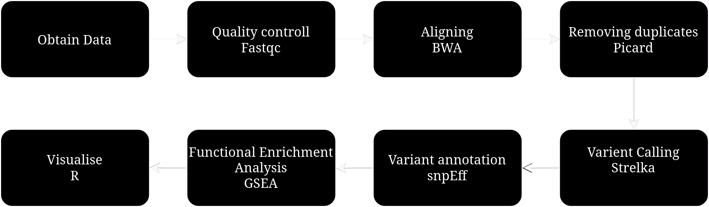
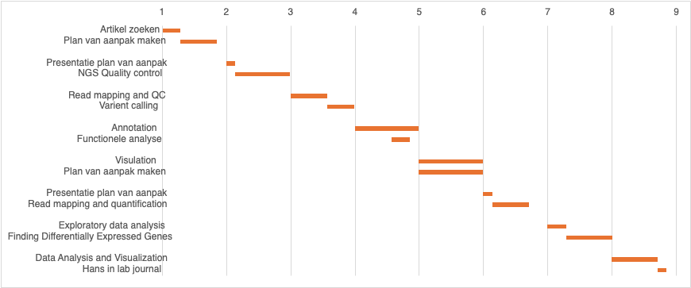

# Genomics Onderzoek blaaskanker
 door 
Ramon Reilman, Jasper Jonker, Iris Ineke, Janine Postmus

---
# Blaaskanker
*  83 duizend
* 17 duizend
* 15%
---

## Onderzoek
* Behandeling
* Immuunchecpointeiwtten
* Entinostat

---
## Entinostat
* Remming HDAC1\3
* Acetylgroepen
* transcriptionele repressie
---
## Immuuncheckpointeiwitten

---
## Opzet
* 2 groepen
* 3 samples / groep
* NSG en C57BL/6 muis 

---

## Technische achtergrond
* mouse reference genome, mm9
* WES, illumina HiSeq 2500

---

## Tools

| Tool      | Functie      |
| - | - |
| Burrows-Wheeler Aligner | DNA aligning |
| Picard | Verwijderen van duplicaten |
| Strelka | Vinden van mutaties |
| snpEff | impact van mutatie op eiwitten|

---

# Ons Plan
* Volgen artikel
* gene set enrichment analysis
---
## Gene set enrichtment analysis
* Genen met een SNP
* Biologische pathways
---
## Workflow

---
## Planning

---
## Bronnen
- https://www.jci.org/articles/view/138560#SEC2
- https://www.cancer.gov/about*cancer/treatment/types/immunotherapy/checkpoint*inhibitors#:~:text=Checkpoint%20proteins%2C%20such%20as%20PD,the%20body%20(left%20panel).
- https://www.apotheek.nl/medicijnen/cisplatine
- https://jhoonline.biomedcentral.com/articles/10.1186/s13045*024*01551*8